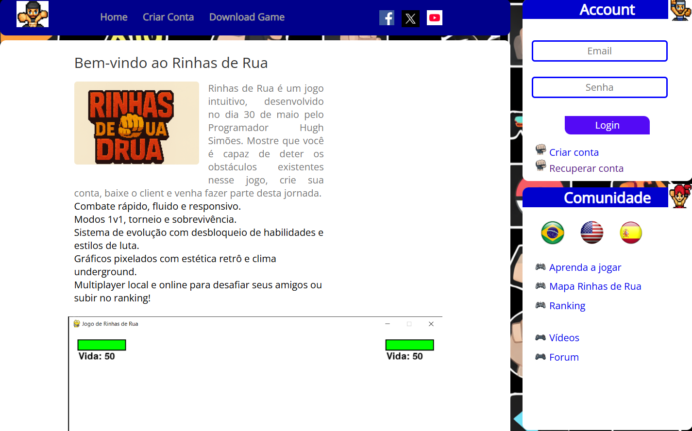
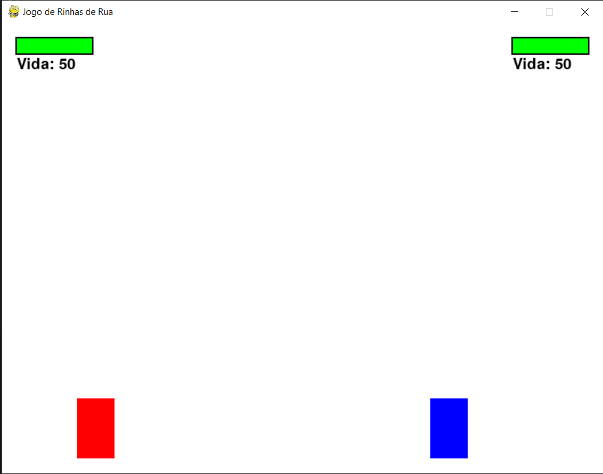
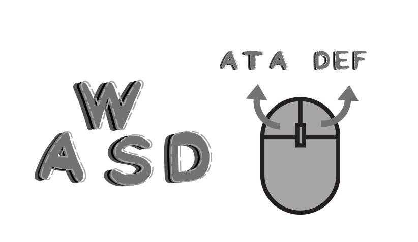

# 🎮 Site & Jogo - Login Integrado

Este projeto combina um **site de autenticação em Flask** com um **jogo em Pygame**. O usuário precisa criar uma conta e fazer login no site antes de acessar o jogo.

🔒 Somente usuários autenticados podem jogar.  
🎮 O jogo é construído em Pygame que pode ser consumido logo após o login bem-sucedido.

---

## 📷 Demonstração

### 💻 Tela do Site


### 🕹️ Tela do Jogo


### 🕹️🎮 Como Jogar


---

## 🚀 Tecnologias utilizadas

- 🐍 Python
- 🛠️ HTML + CSS para o front-end
- 🌐 Flask
- 💾 SQLite3
- 🖼️ Pygame
- 🧠 Sistema de autenticação


---

## ⚙️ Crie um ambiente Windowns

```bash
> mkdir myproject
> cd myproject
> py -3 -m venv .venv
```

## ⚙️ Ative o ambiente Windowns

```bash
> .venv\Scripts\activate

```
## ⚙️ Crie um ambiente Linux | Mac

```bash
$ mkdir myproject
$ cd myproject
$ python3 -m venv .venv
```
## ⚙️ Ative o ambiente Linux | Mac

```bash
$ . .venv/bin/activate
```

## ⚙️ Instalação do Flask
```bash
$ pip install Flask
```
<a href="https://flask.palletsprojects.com/en/stable/" target="_blank">
Acesse o site oficial</a>

## Quickstart Flask
```bash
from flask import Flask

app = Flask(__name__)

@app.route("/")
def hello_world():
    return "<p>Hello, World!</p>"
```

## ⚙️❗❗ Instalação do Sqlite3

A biblioteca **Sqlite3** não precisa de **Instalação**
<a href="https://docs.python.org/3/library/sqlite3.html#" target="_blank">
Acesse o site oficial</a>

---
## ⚙🎮 Instalação do PyGame

```bash
pip install pygame
```
<a href="https://www.pygame.org/docs/" target="_blank">
Acesse o site oficial</a>

